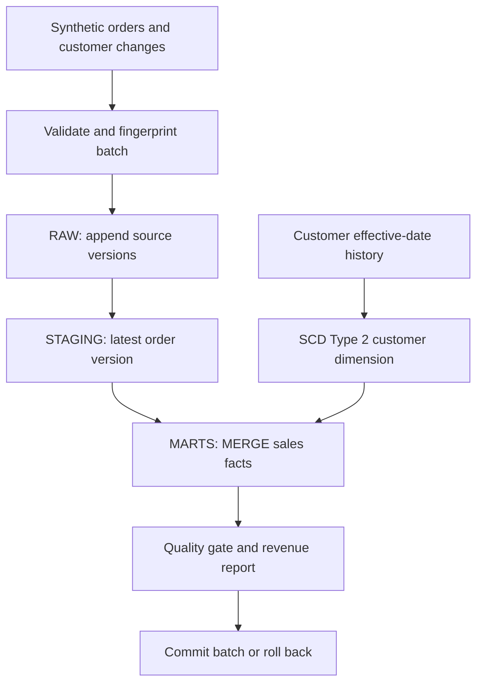

# Retail ELT warehouse

**Turn changing retail orders into reconciled sales facts with historically correct customer regions.**

A small retail business needs consistent revenue reporting even when orders arrive late,
source systems correct quantities, and customers move between regions. This project models those cases
instead of treating every CSV row as a new sale.

**Verified locally and in Snowflake:** 1,220 sales facts, 66 customer versions, and zero failures across six SQL quality checks. A caller-rights Snowpark Python procedure executes the same loading logic and modeling SQL in a dedicated cloud sandbox. Ten cloud assertions cover totals, replay, historical regions, conflicts, and rollback. This is synthetic portfolio work, separate from professional experience.

## Review in 60 seconds

| Question | Evidence |
|---|---|
| What is the grain? | One sale line per `order_id`; see [model](docs/model.md) |
| How do corrections work? | Latest source version plus an idempotent [MERGE](sql/003_merge.sql) |
| How is history preserved? | Effective-dated SCD Type 2 customer dimension |
| What happens on failure? | Raw rows, dimension changes, facts, and batch marker roll back together |
| Can I reproduce it? | Three commands below; no account or credit card |
| Where are results? | [Local report](examples/run_report.json), [Snowflake report](examples/snowflake_run_report.json), [cloud verification](docs/cloud-verification.md) |

## Architecture



The diagram describes the shared loader executed locally on DuckDB and in a Snowflake sandbox through Snowpark. It does not represent a continuously scheduled or production deployment.

## Run

Python 3.11 or 3.12. Commands assume the repository root. On Windows, activate `.venv\Scripts\activate`
instead of the POSIX activation command.

```bash
python -m venv .venv
source .venv/bin/activate
python -m pip install -r requirements.txt
python -m warehouse.pipeline --demo
python -m pytest -q
```

The demo loads the initial batch, loads the correction/late-arrival batch, and replays the second batch.
Output goes to `artifacts/run_report.json`; the database is `artifacts/retail.duckdb`.
Re-running against the same database reports replays. For a fresh run, use a different database:

```bash
WAREHOUSE_PATH=artifacts/fresh.duckdb python -m warehouse.pipeline --demo
```

`.env.example` documents configuration; the application reads exported environment variables and does
not automatically read `.env`. It never logs connection credentials.

## Model and SQL

| Object | Grain and behavior |
|---|---|
| `raw.sales` | Every loaded source version, identified by order and UTC version timestamp |
| `raw.batches` | One successfully committed input fingerprint |
| `staging.sales` | Latest version per order using `ROW_NUMBER` and `QUALIFY` |
| `marts.dim_customer` | Customer version, with `[valid_from, valid_to)` intervals and an MD5 surrogate key |
| `marts.dim_product`, `marts.dim_store` | Natural-key reference dimensions |
| `marts.dim_date` | Distinct order date with calendar attributes |
| `marts.fact_sales` | One line per order; quantity, integer price cents, and revenue cents |

Representative business rule:

```sql
JOIN marts.dim_customer c
  ON s.customer_id = c.customer_id
 AND s.order_date >= c.valid_from
 AND s.order_date < c.valid_to
```

An order on September 5 keeps its original region even if it arrives after the September 10 region change.
Revenue uses integer cents rather than floating-point arithmetic. The [analytics query](sql/005_analytics.sql)
joins facts to customer versions, aggregates revenue by region, and ranks regions with `DENSE_RANK`.

## Verified results and tests

The fixtures contain 1,200 original lines, 30 corrections, 20 late orders, and five stale updates.
Both the local and verified Snowflake result are 1,220 facts and **7,821,134 revenue cents**. Replaying the second batch changes nothing.
Those figures describe this synthetic dataset only.

Tests cover replay, stale versions, SCD Type 2 lookup, exact revenue reconciliation, invalid dates/amounts,
missing dimension references, conflicting timestamps, and transaction rollback including dimension changes.
The six SQL checks cover customer/product/store resolution, fact count, revenue, and duplicate facts. An additional explicit guard rejects duplicate customer-history versions, because Snowflake standard tables do not enforce their primary keys. Existing order versions are fetched in groups of at most 500 order IDs rather than one query per input row.

## Snowflake path

See [Snowflake execution](docs/snowflake.md) for the reproducible Snowpark procedure, sandbox setup, and execution commands. [Captured cloud evidence](docs/cloud-verification.md) records the actual result and boundaries. Snowpark 1.55.0 and Python 3.12 were used. The separate password-based connector CLI remains unverified. Streams, Tasks, production RBAC deployment, and performance improvements are not claimed.

## Decisions and limits

* Full staging deduplication and a MERGE over the modeled dataset keep the example inspectable. This is
  not a benchmark or an optimized CDC service; production would filter affected keys and measure query profiles.
* The source must provide a trustworthy version timestamp. Equal timestamps with different payloads fail.
* SCD Type 2 inputs are effective-dated change records, not periodically diffed full snapshots.
* One currency, one line per order, no deletes/returns, and one writer are deliberate boundaries.
* Customer/date dimensions are views over history. Product and store attributes are static seed data here;
  the project does not implement general Type 1 attribute updates.
* In-memory CSV parsing is suitable for the fixtures. Large files require chunking, COPY/staging, and load budgets.

Next improvements: verify the external connector CLI, capture query profiles, implement delete/return events,
then add affected-key processing and a checkpointed CDC integration. Add Streams/Tasks only with cloud
execution evidence and transactional offset tests.

## Navigation and attribution

`warehouse/` contains the loader; `sql/` contains the schema, models, merge, checks, and report;
`data/` contains synthetic fixtures and a deterministic generator; `tests/` contains behavioral tests;
`examples/` holds captured outputs; `docs/` explains design and cloud boundaries.

Code is MIT licensed. Synthetic data is CC0 1.0. This completes the warehouse layer proposed in the
existing cloud portfolio starter. [Attribution](ATTRIBUTION.md) separates inherited ideas from implemented work.
