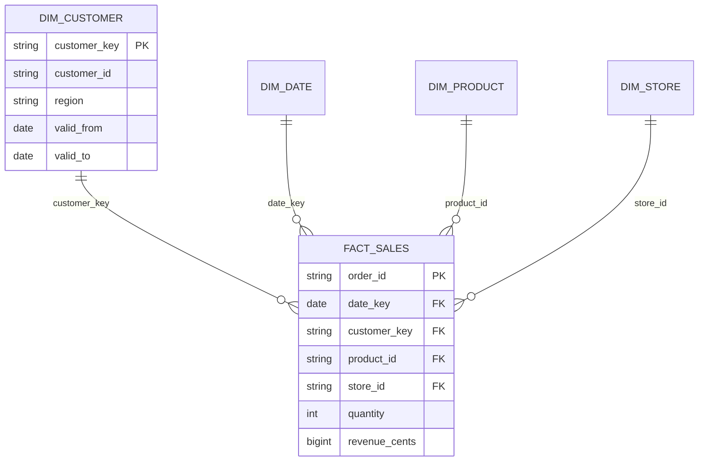

# Model contract

Foreign-key consistency is enforced by the data quality gate rather than engine-specific foreign-key DDL.
The customer key is a deterministic hash of the natural key and effective date. MD5 is used as a compact
non-security identifier; it is not used for authentication. Input integrity uses SHA-256.

The dimension uses LEAD to create nonoverlapping intervals. The fact MERGE remaps customer keys when
history changes, so late customer effective dates can revise historical assignments. This is a deliberate
restatement policy, not an immutable financial ledger.

The source timestamp governs correction order, while order_date governs historical customer lookup.
Those are different concepts. Five deliberately stale source versions cannot overwrite newer quantities.

Only exact batch replay is skipped. A differently formatted file can be loaded as a new batch, but latest
version selection and fact MERGE prevent double-counting. Raw ingestion history can retain repeated versions.
